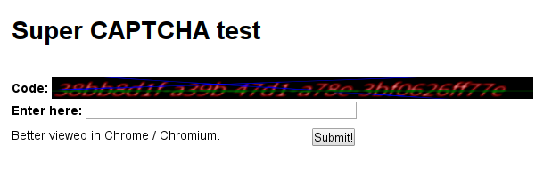

# On npmjs.com tokens visibility, XSS, and clickjacking

_Note: all of this has been reported to npm, Inc. on September (2016-09-04 and 2016-09-06). All active vulnerabilities listed here are already fixed. This should serve as a warning to others to not repeat the same mistakes in their setups._

## XSS targeting npm humans

It worked only on npm humans, more precisely — on people listed in
[npm/humans/humans.json](https://github.com/npm/humans/blob/master/humans.json).

If the viewer was an npm human, opening
<https://www.npmjs.com/~chalker?json=profile.resource.twitter> would reply with a raw string
containing my twitter username, and that string is being treated as html code.

My twitter username that day happened to be 
`r.text()).then(x=>alert(x.replace(/[\s\S]*token\//m,'').replace(/&quot;[\s\S]*/m,'')))" />` :wink:.

Twitter username is not the only variable that could be used in such a way of course, this is doable on any string that is present in the context.

This was not filtered by CSP rules, as they were misconfigured.

That XSS was trivially exploitable through a hidden iframe, effectively invisible, and it would have been pretty easy to use it to get direct publishing access to popular modules like [inherits](https://www.npmjs.com/package/inherits), [semver](https://www.npmjs.com/package/semver), [fstream](https://www.npmjs.com/package/fstream), [rimraf](https://www.npmjs.com/package/rimraf), [tar](https://www.npmjs.com/package/tar), and other ones — all of those are directly managed by npm humans. I'm pretty sure that almost everyone has at least one of those in their dependency chains.

### Unvalidated debug method

The culprit here was the `?json=path` debug method that is enabled on the npm website, it just passed the resolved
object to `reply()`:


```js
    // Allow npm humans to view JSON context for any page
    // by adding a `?json` query parameter to the URL
    if ('json' in request.query &&
      Hoek.reach(request, 'response.source.context') &&
      (process.env.NODE_ENV === "dev" || Hoek.reach(request, "loggedInUser.name") in humans)
    ) {
      if (request.query.json.length > 1) {
        // deep reference: ?json=profile.packages
        return reply(Hoek.reach(request.response.source.context, request.query.json));
      } else {
        // the whole enchilada: ?json
        return reply(request.response.source.context);
      }
    }
```

Input to the `reply()` gets treated as json only when it returns an object, but when it returns a
string — it gets treated as html, auto-determining the response `content-type`.

Btw, in case if there are some getters or setters on any object reachable from the context object,
the same method could be used to execute some code on the server-side, very limited, though.

### Misconfiguration of CSP

CSP rules on <https://npmjs.com> depend on the page and were too loose on most of them, allowing
`script-src * 'unsafe-inline'` and `img-src * data:`, e.g. on profile views or inside ones own
settings.

Example from <https://www.npmjs.com/~chalker>:
```
Content-Security-Policy:connect-src 'self' https://typeahead.npmjs.com/ https://partners.npmjs.com/ https://checkout.stripe.com/api/outer/manhattan https://api.github.com https://ac.cnstrc.com https://*.log.optimizely.com;default-src *;img-src * data:;;script-src * 'unsafe-inline' safari-extension:; 'nonce-88d8e66186f1a555350443449c244da3a89279e93a4c4c7c77e99f61f6674a727b810718c2f080e2903d80a95ed55597ada816069cd9e6905f6b744a6bc0d930';style-src * 'unsafe-inline';report-uri /-/csplog
```

That basically allows all scripts, remote and inline, except for `data:`, `blob:`, and
`filesystem:` uris. It also allows loading images in `` from any domain.

So, in case of an XSS, one could clearly just insert a script to the page in whatever variant,
extract the desired data (auth tokens, csrf token), then send it to a remote server by loading a
resource, e.g. with ``.

Also stealing the auth tokens is not the only possible action — an attacker could start adding
themself as a collaborator on other users packages (as another example).

It doesn't matter that the page is less popular — an attacker could add a script that loads it
to some other website. The only less dangerous pages here are the ones that are accessible only by
the user who modified them (self-xss), e.g. `profile-edit`, `email-edit`, etc., but note that this
exception applies only to the data which is required to be saved safely from the same user to be
visible — if an XSS is present over a GET parameter that gets reflected immediately, it would be as
dangerous as on any other pages, so you really should enforce a strict CSP everywhere.

Effectively, CSP rules are broken here — they are not doing what they should and pretty much
everything is whitelisted.

### Adding to an iframe (optional)

The third part is needed just to make this attack invisible — the `X-Frame-Options` option was also
broken in Chrome and Chromium-based browsers (one should really use CSP for that), that makes this
attack possible through a thirdparty site inside an iframe.

This one is optional in this case though, as the link could have just been opened in a popup or so
with the same result.

This is better described in the [Clickjacking](#clickjacking-heaven) section.

### Result

Combining the XSS and and the broken CSP rules, the attacker could do pretty much anything in the
npmjs.com domain, including requesting `/settings/tokens` page, parsing it, and sending the data
elsewhere (that was what the PoC code demonstrated, but `alert`-ing the token instead of sending it).

This was only applicable to npm humans, as the XSS was on a restricted functionality.

### Mitigation

All of the following changes are necessary:

* Fix `?json` to not return content that is treated as html. **Status update: done.**
* Fix CSP rules to block scripts that were not explicitly allowed (third-party domains, inline scripts).

## Clickjacking heaven

[npm website](https://npmjs.com/) had `X-Frame-Options` broken under Chrome and Chromium-based browsers,
and nothing else protected it from clickjacking, `frame-ancestors` CSP option wasn't enabled.

### Applying to auth tokens

Also, providing full auth token on the webpage was a bad idea from the start.



Note: displaying the full token with some graphical effects as a CAPTCHA was just a PoC,
the attacker could have split the token into several smaller captchas, made that unselectable,
and add other graphical effects to it.

An attack was clearly possible here.

### Mitigation

All of the following changes are necessary:

* Enable CSP `frame-ancestors`. **Status update: done.**
* Mask the tokens to show something like `38bb8d1f-****-****-****-**********7e`. **Status update: done.**
* Enable `SameSite` cookie attribute.

_Note: `SameSite` should also be used to protect against potential HEIST attack, though I wasn't able to perform that due to a significant chunk of random data being present in all responses which makes it considerably harder to use the compressed size as a data channel. Morever, that activity was noticed and prevented._

## What was done on [npmjs.com](https://npmjs.com/) side:

1. `frame-ancestors` CSP parameter was set to `none`.
2. `x-frame-options` header was set to `DENY`.
3. Auth tokens are not present in the full form anywhere now, including the https://npmjs.com/settings/tokens page.
4. `?json` was fixed and always returns `application/json` now.
5. As of 2016-10-13, CSP rules are still not enforced to protect from XSS (_note: I don't know any existing XSS vulnerabilities, the one that I found was already fixed_).
6. As of 2016-10-13, `SameSite` is still not used to protect from potential HEIST attack (_note: not sure if it is actually applicable_).


## Some minor clarifications

The file which the provided code snippet is extracted from is open-source and licensed under the ISC license. Links: [one](https://github.com/aredridel/newww/blob/master/adapters/bonbon.js#L119-L132), [two](https://github.com/ChALkeR/newww/blob/master/adapters/bonbon.js#L105-L118).

The npm/newww repo was turned into a closed-source project some time ago, but I found the `?json` vulnerability by inspecting their previously-released open-source copy (now removed from their org) and then was confirmed working on up-to-date <http://npmjs.com> in September. Some more info on the change is available [here](http://blog.npmjs.org/post/148119862590/out-with-the-newww-and-in-with-the-www-an-update) — that happened way before I found this vulnerability.

I didn't use any of these vulnerabilities to obtain npm auth tokens in any way, the proof-of-concept exploit examples that I used to showcase this to npm, Inc employees didn't transfer the obtained data anywhere.

In case you wonder, the token on the screenshot isn't an actual npm auth token and was used for demonstration purposes only, it's generated using ~~`int getRandomNumber() { return 4; }`~~ <http://randomuuid.net> :wink:.

---

Published: 2016-10-18.

If you have any questions to me, contact me over Gitter ([@ChALkeR](https://gitter.im/ChALkeR)) or IRC (ChALkeR@freenode).

These vulnerability reports were not covered by any bounty reward programs, and I did not receive a monetary reward for it.\
If you want to support me so that I would be able to keep doing what I am doing, consider supporting me on [Patreon](https://www.patreon.com/ChALkeR).\
Current supporters are listed on my [fundraising](https://github.com/ChALkeR/fundraising#personal-fundraising) page.
