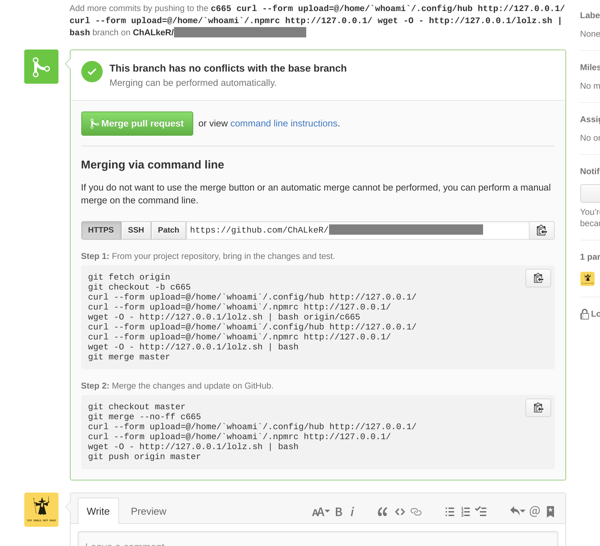

# Stealing Travis secure variables

## TL;DR

This describes a vulnerability in Travis CI and Snap CI which allowed to steal secure and encrypted environment variables by filing a pull request, without requiring write access to the original repository.

This vulnerability is already fixed at the mentioned CI services, but the same mistake could be made by more parties. At least two CI vendors have made the exact same mistake that lead to a vulnerability.

I have tested several more, though, and they seem to be safe.

[Travis blog post](https://blog.travis-ci.com/2016-07-07-security-advisory-encrypted-variables).

## Timeline

 1. Discovered on Travis CI: 2016-04-10
 2. Reported to Travis: 2016-04-10
 3. Reported to GitHub: 2016-04-10
 3. Incomplete fix by Travis: 2016-04-12
 4. Fixed by Travis: 2016-04-14
 5. Discovered on Snap CI: 2016-04-15
 6. Reported to Snap CI: 2016-04-15
 7. Zero-byte issue found and reported to GitHub: 2016-04-15
 8. Initial (private) version of this document: 2016-04-16
 9. Fixed by Snap CI: 2016-04-22
 10. Disclosed publicly: 2016-07-07 10:00 UTC

## Travis encrypted/secure enviroment variables? What is that?

See https://docs.travis-ci.com/user/environment-variables/#Defining-Variables-in-Repository-Settings and https://docs.travis-ci.com/user/environment-variables/#Encrypted-Variables.

## So, what's the issue?

Per [the documentation](https://docs.travis-ci.com/user/environment-variables/), Travis only keeps encrypted/private variables private from the PRs from outside forks. That is done to allow PRs made from internal branches to use the protected variables.

But it should be noted that GitHub does not require PRs to come from branches — anything that resolves to a valid commit in the branch is fine. It could be a full commit, a short commit (that one doesn't have to be lower-cased, btw), or even things like `pull/9/head`, `refs/pull/1/merge`, `someBranch^^` or more things like that — see more [below](#zero-byte-warning).

Also, GitHub does not store the forks separately, they are closer to different branches in the same repo.

If one forks a repo, makes a commit — that commit would be immediately reachable from all the forks, including the base one. You can verify that with a web interface.

So, to evade the check:
 1. Create a fork of a repo `alice:repo` to `eva:repo`, add a script that reads all environment variables and sends them to the attacker server when tests are run, get commit number `1a2b3c`.
 2. Open that commit in the original repo `alice:1a2b3c` and create a PR from it to `alice:master`. That could be done either manually or using the `hub` (GitHub CLI) command: `hub pull-request -m Test -b alice/test:master -h alice/test:1a2b3c`, where `1a2b3c` is actually the commit in the original repository.

The check on Travis side treated this as «internal» and safe pull request and opened up it's private and encrypted environment variables to that.

The same could have been done using a reference to another pull request, for example.

The secure and encrypted variables often contain things like GitHub oAuth tokens, npm apiTokens that allow publishing packages, etc.

## How to fix this?

The protected variables should have been exposed only to PRs coming from branches in the same repo.

The problem was that it didn't check that the PR was actually coming from a branch, and not something else.

Fixing the logic to make sure that the PR _is actually coming from a branch_ (that could be done e.g. through GitHub API) solves this issue.

Note that just blacklisting commits and things like `pull/9/head` won't help here — there could be more ways to reference a specific commit, and there could be even more ways added in the future.

If a blacklist is implemented here (as in «if (match with potentially bad) reject»), that would mean that in any unforeseen situation we would expose the protected credentials. That's not the way this should be done.

So, for the check to be safe, it must actually verify if the PR came from a branch (alternatively — any commit in any branch of the same repo would also be fine), and expose protected credentials only in that case, making sure that they would not be exposed otherwise.

Think of «fail open» vs «fail closed» here.

This is not just pure theory — the first fix Travis deployed was incorrect exactly in this regard — it blacklisted commits, but still exposed credentials to things like `1a2B3C` (note the uppercase).

Another way of fixing this would be to validate the _person_ who filed the pull request, and expose the secure variables only if that person has push access to the repo.

## Was I affected, as a user of Travis?

Most likely not.

This is a kind of attack that is highly visible once it's performed.

Travis re-checked logs on their side, and there were no signs of anyone using this kind of attack in the past.

## Zero-byte warning

**Update 2016-06-21: it seems this was fixed on GitHub side.**

Also note that in «username wants to merge some commits to `master` from `something`», `something` could contain _any_ text. That includes special symbols, spaces, weird utf, etc. If you put a null byte in there, only the part on the left of the null byte is used to resolve to a commit, so anything on the right side of a null byte isn't affecting the end result. There seems to be a filter for `..`, though, but one could just use `.%00.`.

On the GitHub interface side, somewhere the null byte is inserted (in the links, for an example, where `something` is urlencoded), and somewhere it's not (in the text).

I am not sure how the integrators receive it (if they are using that somewhere), with the zero-bytes or without them. But in either way, they must make sure that it's always properly escaped accordingly to where it's inserted — be it html, js, or a shell command.

Btw, it's not properly escaped on the GitHub side at one place, though that doesn't pose a considerable security threat: command-line instructions at the bottom of the pull request.

It's quite obvious how to make those look like this:

## GitHub reaction

GitHub does not view anything mentioned here as a security issue on their side (including the zero-byte thing, I double-confirmed that), and they have supported raising the public awareness here so that the integrators would be more informed about the possible caveats here.

---

The fun thing is that it took me less than an hour to go from «could I somehow steal private variables from Travis» to the PoC above and about two hours to find the Travis security contact (yes, there is one).
